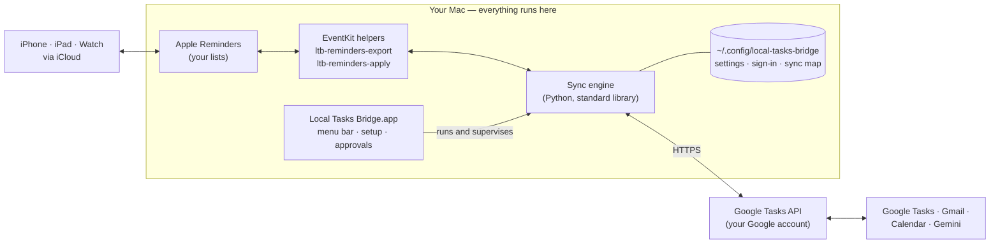

# Local Tasks Bridge

**English** · [简体中文](README.zh-CN.md)

Two-way sync between Apple Reminders and Google Tasks that runs entirely on
your Mac.

Local Tasks Bridge is a small menu bar app. It copies new items, edits,
completions and deletions between the Reminders lists you choose and the Google
Tasks lists with the same names. There is no server in between: your Mac talks
to Reminders through macOS and to Google directly over HTTPS, and every
credential and sync record stays in your home folder.

> [!NOTE]
> **Version 1.0.** Builds are ad-hoc signed and not yet notarized by Apple, so
> macOS asks you to confirm the first launch of a copy downloaded with a
> browser ([steps below](#option-b-download-from-releases)). The one-line
> installer and the Releases page work once the GitHub repository and its first
> release are published — until then, [build from source](#option-c-build-from-source).

## Features

- **Two-way sync of the lists you choose.** Each selected Reminders list is
  paired with the Google Tasks list of exactly the same name, which is created
  in Google if it doesn't exist. Titles, notes, due dates and completion sync in
  both directions.
- **Completions and deletions, with brakes.** Completing or deleting an item on
  one side does the same on the other. A cycle that would complete or delete
  more than 25 items, or more than 25 % of the items the bridge manages, is held
  until you approve it — and everything else keeps syncing in the meantime.
- **Local-first, no server.** No account with us, no telemetry, no cloud relay.
  Only your Mac, Apple and Google are involved. See [PRIVACY.md](PRIVACY.md).
- **Native menu bar app** with a setup assistant, status at a glance,
  **Sync Now**, **Pause Sync**, and a review window for held changes.
- **English and Simplified Chinese** in the app and on the command line.
- **Works with everything that uses Reminders:** the macOS Reminders widget,
  Siri, and your iPhone, iPad and Apple Watch through iCloud.
- **Brings Google's tasks to your Mac:** tasks you add in Google Tasks, Gemini,
  Gmail or Google Calendar appear in Reminders.
- **A command line too.** The `ltb` tool runs the same engine: status, dry
  runs, diagnostics, approvals and migration.

## How it works



Each sync cycle reads the selected Reminders lists and the matching Google
lists, works out a complete plan of changes in both directions, checks the plan
against the safety limits, applies it, re-reads Google to verify titles and due
dates, and saves its sync map. Cycles run every minute (every five minutes with
the shared sign-in, see [below](#choosing-a-sign-in-method)) and right after you
change something in Reminders. The details are in
[docs/architecture.md](docs/architecture.md).

Syncing happens only while the Mac is on, awake and you are logged in. Changes
made on your phone or in Google while the Mac sleeps are picked up when it
wakes.

## Requirements

- macOS 13 Ventura or later, on Apple silicon or Intel.
- Apple Reminders with the lists you want to sync. Use iCloud lists if you also
  want the changes on your iPhone, iPad and Apple Watch.
- A Google account.
- For the “own client” sign-in method: a free Google Cloud project (no billing
  account needed). It takes about ten minutes — see
  [docs/google-cloud-setup.md](docs/google-cloud-setup.md).
- For building from source: the Xcode Command Line Tools, which provide Swift
  and Python 3.9 or newer. The full Xcode app is not needed.

The sync engine runs on Python 3.9 or newer. Release builds include their own
Python, so you don't need to install anything. An app built from source uses
the Python of the Command Line Tools (or Homebrew's); if none is found, the app
explains how to install Apple's free Command Line Tools.

## Install

### Option A: one-line installer (recommended)

```bash
curl -fsSL https://raw.githubusercontent.com/siyuanj/local-tasks-bridge/main/install.sh | bash
```

The installer downloads the latest release for your Mac's processor, checks it
against the published `SHA256SUMS`, installs **Local Tasks Bridge.app** into
`~/Applications`, links the `ltb` command into `~/.local/bin` and opens the app.
It never uses `sudo`. Because the app is not downloaded by a browser and the
installer clears the quarantine flag, you won't see the Gatekeeper prompt. You
are welcome to read [install.sh](install.sh) first.

Options go after `bash -s --`, for example
`curl -fsSL …/install.sh | bash -s -- --version v1.0.0`:

| Option | Effect |
| --- | --- |
| `--version vX.Y.Z` | Install that release instead of the latest |
| `--dest DIR` | Install into `DIR` (default `~/Applications`; `/Applications` works too) |
| `--zip PATH` | Install a release zip you downloaded; a `SHA256SUMS` next to it is verified |
| `--from-source [DIR]` | Build from source instead (needs the Xcode Command Line Tools) |
| `--no-cli` / `--no-open` | Don't link `ltb` / don't open the app afterwards |
| `--uninstall` | Remove the app, login item and `ltb` link (add `--revoke`, `--delete-data`, `--yes` as needed) |

Run it with `--help` for everything else.

### Option B: download from Releases

1. Open the [latest release](https://github.com/siyuanj/local-tasks-bridge/releases/latest)
   and download `SHA256SUMS` and the zip for your Mac:
   `LocalTasksBridge-macos-arm64.zip` for Apple silicon (M1 and later) or
   `LocalTasksBridge-macos-x86_64.zip` for Intel. Not sure? Apple menu →
   **About This Mac**: “Chip: Apple M…” means Apple silicon.
2. Optional but recommended — compare the checksum with the published one:

   ```bash
   cd ~/Downloads
   shasum -a 256 LocalTasksBridge-macos-*.zip
   cat SHA256SUMS
   ```

3. Double-click the zip and move **Local Tasks Bridge.app** into the
   Applications folder (`/Applications`, or `Applications` in your home folder).
4. Open the app. Because 1.0 is not notarized, macOS blocks the first launch
   once:
   - **macOS 15 Sequoia and later:** macOS reports that “Local Tasks Bridge”
     was not opened. Click **Done**, open **System Settings → Privacy &
     Security**, scroll down to **Security**, click **Open Anyway** next to the
     message about Local Tasks Bridge, and confirm with your password or Touch
     ID.
   - **macOS 13 Ventura and 14 Sonoma:** Control-click the app, choose
     **Open**, then click **Open** again (or use **Open Anyway** as above).

   This is needed once for each downloaded version. Alternatively, let the
   installer handle the zip, which skips this step:
   `curl -fsSL https://raw.githubusercontent.com/siyuanj/local-tasks-bridge/main/install.sh | bash -s -- --zip ~/Downloads/LocalTasksBridge-macos-arm64.zip`

### Option C: build from source

```bash
xcode-select --install   # once, if the Command Line Tools are not installed
git clone https://github.com/siyuanj/local-tasks-bridge.git
cd local-tasks-bridge
make install
```

`make install` builds this checkout — the Reminders helpers and the app — and
installs **Local Tasks Bridge.app** into `~/Applications` with the installer,
links `ltb` and opens the app. To bundle a private Python into the app, use
`make install INSTALL_ARGS="--embed-python"`. A build from source does not
contain the shared Google sign-in, so pick **your own Google Cloud client** in
the setup assistant ([guide](docs/google-cloud-setup.md)). Apps you build
yourself are not quarantined, so there is no Gatekeeper prompt. More build
targets are listed in [CONTRIBUTING.md](CONTRIBUTING.md).

## First run: the setup assistant

The first time you open the app, a setup assistant walks you through these
steps:

1. **Reminders access.** macOS asks whether Local Tasks Bridge may access your
   reminders — click **Allow**. macOS grants access to all lists, but the bridge
   reads and writes only the lists you select in step 4.
2. **Sign-in method.** Choose **Quick sign-in**, the shared client built into
   release builds (nothing to set up), or **Use my own Google Cloud OAuth
   client** and import the JSON file you downloaded from Google with **Choose
   Client JSON…**. See the [comparison](#choosing-a-sign-in-method).
3. **Google sign-in.** Your browser opens Google's sign-in page; choose your
   account. While a client is unverified, Google shows **“Google hasn't
   verified this app”**: click **Advanced**, then **Go to … (unsafe)**. Leave
   the permission **“Create, edit, organize, and delete all your tasks”**
   ticked — a sign-in without it is rejected.
4. **Choose lists.** Tick the Reminders lists to sync. Each pairs with the
   Google Tasks list of exactly the same name, which is created in Google if it
   is missing. To bring an existing Google list to the Mac — for example
   **My Tasks**, where Gmail, Google Calendar and Gemini put new tasks — click
   **Create in Reminders** next to it under *Google Tasks lists without a
   matching Reminders list*; the new list gets exactly the same name.
5. **Choose how to sync.** The defaults suit most people: two-way sync,
   completions and deletions within the safety limits, reminders without a due
   date included, existing Google tasks imported, and the sync interval. In
   mainland China, set the network proxy here as well (see
   [Network and proxy](docs/troubleshooting.md#network-and-proxy)).
6. **Run the first sync.** The assistant first runs a dry run and shows what
   would happen, for example how many tasks will be added to Reminders and how
   many reminders to Google Tasks. When you click **Start Syncing**, it runs the
   first real sync with deletions and completions switched off — the first sync
   never deletes or completes anything — and then syncs in the background and
   at every login. The last page also offers **Install Command-Line Tool** for
   `ltb`.

If you used an earlier version of this bridge (the 2026-09 private trial or the
upstream `icloud-reminders-google-sync`), the assistant offers **Import My
Existing Setup** instead. It keeps your Google sign-in and sync map; see
[docs/migration.md](docs/migration.md).

## Choosing a sign-in method

Local Tasks Bridge signs in to Google with an OAuth “client” — the identity of
the app that Google shows on its consent screen. Your tasks travel directly
between your Mac and Google with either method.

| | Quick sign-in (shared client) | Your own Google Cloud OAuth client |
| --- | --- | --- |
| Setup | None | About 10 minutes in the Google Cloud console ([guide](docs/google-cloud-setup.md)) |
| Available in | Release builds that include it | Every build, including source builds |
| Consent screen | “Google hasn't verified this app” until the maintainer completes Google's verification | The same warning for your personal, unverified app — expected |
| User limit | At most 100 new users in total until the app is verified | None for practical purposes — it's your app |
| Google API quota | One 50,000-requests-per-day quota shared by all users | Your own 50,000 requests per day |
| Checking Google for changes | At most every 5 minutes (enforced, to protect the shared quota) | Every minute by default (1, 5 or 15 minutes) |
| Your local edits reach Google | Within seconds (extra syncs at least 30 s apart) | Within seconds |
| Google's changes reach the Mac | Within about 5 minutes | Within about 1 minute |
| Shown in your Google Account as | Local Tasks Bridge | The app name you chose |

You can switch later: import your own client in **Settings… → Google** and
choose **Reconnect Google**.
The sync map is tied to your Google account, not to the client, so signing in
to the same account keeps it.

## Daily use

- The menu bar icon shows whether everything is in sync, a sync is running,
  sync is paused, or something needs your attention. Click it for the time of
  the last sync and the available actions, including **Open Google Tasks**,
  **Open Reminders**, **Open Logs** and **Copy Diagnostics**.
- **Sync Now** starts a cycle immediately. **Pause Sync** stops all syncing,
  even across restarts, until you choose **Resume Sync**.
- Changes you make in Reminders on the Mac — or that arrive from your iPhone
  through iCloud — usually reach Google within seconds: the app notices the
  change and starts a cycle right away.
- Changes made in Google arrive with the next scheduled cycle: within about a
  minute with your own client, within about five minutes with the shared client.
  Google doesn't notify apps about changes to tasks, so the bridge has to ask.
- **Widget tip:** add the Reminders widget (Control-click the desktop, or open
  Notification Center, then choose **Edit Widgets**) and pick a synced list
  such as **My Tasks** to see your Google tasks right on the desktop.
- **Siri tip:** in Reminders → **Settings**, set **Default List** to a synced
  list, so reminders you add with Siri or quick entry end up in Google Tasks
  too.
- **Large batches:** when many deletions or completions are held, the app
  opens **Review Pending Changes** and lists them. **Apply N Changes** carries
  out exactly that batch. **Keep On Hold** keeps it waiting — the bridge won't
  ask again for 6 hours — while everything else keeps syncing. **Review
  Pending Changes…** in the menu reopens it at any time.

## What syncs and what doesn't

Synced in both directions: new items, titles, notes, due dates, completion and
deletion. Lists are paired by exact name.

Limits that come from Google Tasks or from how the bridge matches items:

- **No time of day in Google Tasks.** Google stores only a date, so a reminder
  due Tuesday at 15:00 is due “Tuesday” in Google. The time stays on the Mac:
  editing the task in Google keeps it, and if you move the task to another day
  in Google, the reminder moves to that day at the same time.
- **Repeating reminders:** Google gets the current occurrence as a normal task;
  the repeat rule is not copied and Reminders stays the source of truth.
  Repeating tasks created in Google arrive on the Mac as one-off reminders.
- **Subtasks are not mapped.** The parent–child structure is not copied in
  either direction; a subtask may appear as an ordinary item on the other side.
- **Reminders-only details** — priority, flags, tags, URLs, locations, images
  and alerts — stay in Reminders.
- **Lists are paired by name.** Unselecting a list, or renaming or deleting a
  list on either side, never deletes items — the bridge just stops syncing
  them. A list renamed on one side counts as a new list, so you get a fresh
  copy on the other side; rename it on both sides to keep the pairing
  ([details](docs/troubleshooting.md#renaming-moving-and-unselecting-lists)).
- **One Mac only.** Run the bridge on a single Mac per set of accounts; a
  second Mac syncing the same lists would create duplicates.
- **A footer in Google task notes.** The bridge recognizes items by a few lines
  it adds to the notes of each Google task:

  ```text
  Synced from Apple Reminders.
  List: My Tasks
  Source UID: 9f2c41…
  Source Digest: 7a1e05…
  ```

  Please don't delete or edit these lines; they link the task to its reminder.
  They are not copied into Reminders.

More in [docs/troubleshooting.md](docs/troubleshooting.md).

## Safety and privacy

- **Nothing leaves your Mac except the requests to Google** that sync your
  tasks — and, only when you choose **Check for Updates…**, one request to
  GitHub. There is no telemetry, no analytics and no server run by the
  maintainer. Details: [PRIVACY.md](PRIVACY.md).
- **Every cycle plans before it writes.** The bridge computes the complete set
  of changes in both directions and fingerprints it. A plan with more than 25
  deletions or completions, or more than 25 % of the managed items, is never
  written without your approval. The background sync holds only those
  deletions and completions and keeps syncing everything else. You are asked
  only after the same plan shows up on two cycles in a row, so a momentary
  glitch doesn't put a question on your screen.
- **The first sync never deletes or completes anything**, and if the selected
  lists ever come back completely empty, deletions are skipped for that cycle.
- **Your sync map is bound to your accounts.** It is tied to your Apple account
  and your Google account ID. Signing in again to the same Google account
  continues where you left off; a different Google or Apple account stops the
  sync instead of mixing data, until you choose **Reconnect Google…**.
- **Writes are verified.** After writing, the bridge re-reads Google Tasks and
  checks every synced title and due date.
- **Private files.** Settings, sign-in and sync map live in
  `~/.config/local-tasks-bridge/`, readable only by you. Logs in
  `~/Library/Logs/LocalTasksBridge/` contain task titles — don't post them
  publicly; `ltb doctor` and **Copy Diagnostics** leave titles out.
- **You stay in control of access.** Revoke the Google sign-in any time at
  <https://myaccount.google.com/permissions>, and Reminders access in **System
  Settings → Privacy & Security → Reminders**.

## Command line

The app contains the `ltb` command at
`Local Tasks Bridge.app/Contents/Resources/bin/ltb`; the installer links it as
`~/.local/bin/ltb` (otherwise use **Install Command-Line Tool** in
**Settings… → Advanced**). If your shell can't find it, add
`export PATH="$HOME/.local/bin:$PATH"` to `~/.zshrc` and open a new Terminal
window.

| Command | What it does |
| --- | --- |
| `ltb status` | Current state, last sync and the recommended next step (local and instant) |
| `ltb sync --dry-run` | Show what the next sync would change, without changing anything |
| `ltb doctor` | Check the installation; add `--online` to also test the Google connection |
| `ltb manage` | Interactive recovery menu: check Google, reconnect safely, review held changes |
| `ltb rebuild --dry-run` | After an intended account change: preview rebuilding the sync map; `--yes` rebuilds it (nothing is deleted) |
| `ltb pause` / `ltb resume` | Pause or resume background sync |
| `ltb sync-now` | Ask background sync to run a cycle right away |
| `ltb approvals show` | List held deletions and completions; then `ltb approvals apply <fingerprint>` or `ltb approvals hold <fingerprint>` |
| `ltb migrate --dry-run` | Preview importing an earlier installation; run without `--dry-run` to import |

Commands that read Reminders, such as `ltb sync`, run under the app that starts
them; in Terminal, macOS may ask you to give Terminal access to Reminders.
Every command and option is described in the
[command-line reference](docs/configuration.md#command-line-reference).

## Upgrading

**Check for Updates…** in the menu tells you whether a newer release exists.
To install it:

- **Installer:** run the one-line installer again. It quits the running copy,
  replaces the app and opens the new version.
- **Zip:** quit the app (menu bar icon → **Quit Local Tasks Bridge**), replace
  the app in Applications with the new one and open it. The Gatekeeper step is
  needed again for the new download (or use the installer's `--zip`).
- **Source:** `git pull && make install`.

Your settings, Google sign-in and sync map live in
`~/.config/local-tasks-bridge/` and are kept. Because 1.0 builds are ad-hoc
signed, macOS may treat each update as a new app and ask for Reminders access
again — click **Allow**. **About Local Tasks Bridge** in the menu and
`ltb version` show the installed version. Changes are listed in
[CHANGELOG.md](CHANGELOG.md).

## Uninstalling

In the app, open **Settings… → Advanced** and choose **Uninstall…**. It removes the login
item and moves the app to the Trash; you can also choose to delete your local
data and revoke the Google sign-in.

With the installer, which also removes the app and the `ltb` link:

```bash
curl -fsSL https://raw.githubusercontent.com/siyuanj/local-tasks-bridge/main/install.sh | bash -s -- --uninstall
# add --revoke to revoke the Google sign-in, --delete-data to delete settings, sync map and logs
```

Or with `ltb`, after which you quit the app, move it to the Trash and remove
`~/.local/bin/ltb` yourself:

```bash
ltb uninstall --yes                          # remove the login item; keep settings and sync map
ltb uninstall --revoke --delete-data --yes   # also revoke Google access, delete local data and logs
```

Uninstalling never deletes reminders or Google tasks; the footer lines stay in
the notes of synced Google tasks. A complete manual reset is described in
[Troubleshooting](docs/troubleshooting.md#complete-reset).

## Documentation

- [Create your own Google Cloud client](docs/google-cloud-setup.md)
- [Configuration and command-line reference](docs/configuration.md)
- [Troubleshooting and FAQ](docs/troubleshooting.md)
- [Architecture](docs/architecture.md)
- [Migrating from an earlier installation](docs/migration.md)
- [Releasing (maintainers)](docs/releasing.md) · [Roadmap](docs/roadmap.md) ·
  [Changelog](CHANGELOG.md)
- [Privacy](PRIVACY.md) · [Security policy](SECURITY.md)

Common questions:
[Does the maintainer see my tasks?](docs/troubleshooting.md#does-the-maintainer-see-my-tasks) ·
[Why does Google say the app isn't verified?](docs/troubleshooting.md#google-hasnt-verified-this-app) ·
[Can I use it on two Macs?](docs/troubleshooting.md#can-i-run-it-on-two-macs) ·
[Something says “approval required”](docs/troubleshooting.md#bulk-changes-waiting-for-approval) ·
[“Account binding required”](docs/troubleshooting.md#account-binding-required)

## Contributing

Bug reports and focused pull requests are welcome. Please read
[CONTRIBUTING.md](CONTRIBUTING.md) — every sync behavior change needs a
regression test, safety guards are never weakened, and every user-facing
message is written in English and Chinese. Report security problems privately as
described in [SECURITY.md](SECURITY.md). Participation follows the
[Code of Conduct](CODE_OF_CONDUCT.md).

## License and attribution

Local Tasks Bridge is released under the [MIT License](LICENSE) and maintained
by Siyuan Jiang ([@siyuanj](https://github.com/siyuanj)). It is a fork of
[syncweave-labs/reminders-task-bridge](https://github.com/syncweave-labs/reminders-task-bridge)
(MIT, © 2026 Syncweave Labs contributors), whose history and license notice are
preserved.

Local Tasks Bridge is an independent project, not affiliated with or endorsed
by Apple or Google. Apple, macOS, iCloud, Reminders and Siri are trademarks of
Apple Inc. Google, Google Tasks, Gmail, Google Calendar and Gemini are
trademarks of Google LLC.
