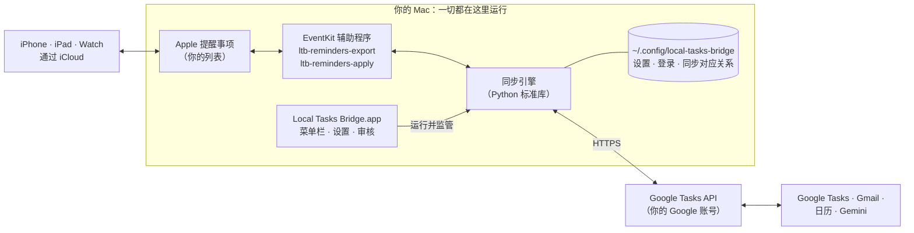

# Local Tasks Bridge

[English](README.md) · **简体中文** · [官网](https://siyuanj.github.io/local-tasks-bridge/zh/)

在你的 Mac 上完成 Apple 提醒事项与 Google Tasks（Google 任务）之间的双向同步，全程不经过任何第三方服务器。

Local Tasks Bridge 是一个小巧的菜单栏 App。它会在你选定的“提醒事项”列表和 Google Tasks 中同名的列表之间，同步新建的条目、修改、完成和删除。中间没有服务器：你的 Mac 通过 macOS 读写提醒事项，通过 HTTPS 直接与 Google 通信；所有凭据和同步记录都只保存在你的个人文件夹里。

> [!NOTE]
> **1.0 版说明。** 目前的构建采用临时签名（ad-hoc），尚未经过 Apple 公证，所以用浏览器下载的副本第一次打开时，macOS 会要求你手动确认（[步骤见下文](#方式-b从-releases-下载)）。一行命令安装和 Releases 下载页要等 GitHub 仓库及首个版本公开发布后才能使用；在此之前，请[从源码构建](#方式-c从源码构建)。

## 功能

- **双向同步你选定的列表。** 每个选中的提醒事项列表，都会与 Google Tasks 中名称完全相同的列表配对；如果 Google 中还没有，会自动创建。标题、备注、截止日期和完成状态双向同步。
- **完成与删除也会同步，并且带“刹车”。** 在一边完成或删除，另一边也会照做。但如果某一轮要完成或删除的条目超过 25 个，或超过桥接所管理条目的 25%，这批操作会先暂缓，等你确认后才执行；在此期间其他改动照常同步。
- **本地优先，没有服务器。** 不需要注册任何账号，没有遥测，没有云端中转。参与其中的只有你的 Mac、Apple 和 Google。详见 [PRIVACY.zh-CN.md](PRIVACY.zh-CN.md)。
- **原生菜单栏 App**，提供设置向导、一眼可见的同步状态、“立即同步”“暂停同步”，以及审核被暂缓更改的窗口。
- **支持英文和简体中文**，App 和命令行都是。
- **与所有使用“提醒事项”的地方配合：** macOS 的提醒事项小组件、Siri，以及通过 iCloud 同步的 iPhone、iPad 和 Apple Watch。
- **把 Google 的任务带到 Mac 上：** 你在 Google Tasks、Gemini、Gmail 或 Google 日历中添加的任务，会出现在“提醒事项”里。
- **也提供命令行。** `ltb` 工具调用的是同一个同步引擎：查看状态、试运行、诊断、审核批量更改、迁移旧安装。

## 工作原理



每一轮同步会读取选中的提醒事项列表和对应的 Google 列表，算出两个方向上完整的更改计划，对照安全上限检查这份计划，然后执行，再重新读取 Google 核对标题和截止日期，最后保存同步对应关系（sync map）。同步每分钟进行一次（使用共享客户端时每五分钟一次，见[下文](#选择登录方式)），你在“提醒事项”里做出改动后也会立即触发一轮。详细说明见 [docs/architecture.zh-CN.md](docs/architecture.zh-CN.md)。

只有当 Mac 开机、未睡眠并且你已登录时才会同步。Mac 睡眠期间你在手机上或 Google 中做的改动，会在它唤醒后被同步。

## 系统要求

- macOS 13 Ventura 或更高版本，搭载 Apple 芯片或 Intel 处理器的 Mac 均可。
- 在“提醒事项”中有你想同步的列表。如果希望改动也出现在 iPhone、iPad 和 Apple Watch 上，请使用 iCloud 列表。
- 一个 Google 账号。
- 如果使用“自有客户端”登录方式：一个免费的 Google Cloud 项目（不需要绑定结算账号），大约需要十分钟，见 [docs/google-cloud-setup.zh-CN.md](docs/google-cloud-setup.zh-CN.md)。
- 如果从源码构建：需要 Xcode 命令行工具（Command Line Tools），它自带 Swift 和 Python 3.9 或更高版本。不需要完整的 Xcode。

同步引擎运行在 Python 3.9 或更高版本上。发布版自带 Python，你不需要另外安装任何东西。从源码构建的 App 会使用命令行工具（或 Homebrew）中的 Python；如果找不到，App 会告诉你如何安装 Apple 免费提供的命令行工具。

## 安装

### 方式 A：一行命令安装（推荐）

```bash
curl -fsSL https://raw.githubusercontent.com/siyuanj/local-tasks-bridge/main/install.sh | bash
```

在中国大陆，curl 不会使用 macOS 系统代理。请先让它走你的代理 App（端口以代理 App 显示的 HTTP 端口为准），例如：

```bash
export https_proxy=http://127.0.0.1:7890
curl -fsSL https://raw.githubusercontent.com/siyuanj/local-tasks-bridge/main/install.sh | bash
```

安装脚本会下载适合你 Mac 处理器的最新版本，用发布页上的 `SHA256SUMS` 校验，把 **Local Tasks Bridge.app** 安装到 `~/Applications`（如果已经安装过，则就地更新原来的副本），把 `ltb` 命令链接到 `~/.local/bin`，然后打开 App。它从不使用 `sudo`。由于 App 不是通过浏览器下载的，安装脚本还会清除“隔离”标记，所以不会出现 Gatekeeper 提示。欢迎先读一读 [install.sh](install.sh)。

选项写在 `bash -s --` 之后，例如 `curl -fsSL …/install.sh | bash -s -- --version v1.0.0`：

| 选项 | 作用 |
| --- | --- |
| `--version vX.Y.Z` | 安装指定版本，而不是最新版本 |
| `--dest 目录` | 安装到该文件夹（默认：已有副本所在的位置，否则为 `~/Applications`；以 `.app` 结尾的路径会被拒绝） |
| `--zip 路径` | 安装你已下载的发布 zip；如果旁边有 `SHA256SUMS`，会先校验 |
| `--from-source [目录]` | 改为从源码构建（需要 Xcode 命令行工具） |
| `--no-cli` / `--no-open` | 不链接 `ltb` / 安装后不打开 App |
| `--uninstall` | 移除 App、登录项和 `ltb` 链接（可按需加上 `--revoke`、`--delete-data`、`--yes`） |

用 `--help` 查看其余选项。

### 方式 B：从 Releases 下载

1. 打开[最新版本](https://github.com/siyuanj/local-tasks-bridge/releases/latest)，下载 `SHA256SUMS` 以及适合你 Mac 的压缩包：搭载 Apple 芯片（M1 及更新）的 Mac 选 `LocalTasksBridge-macos-arm64.zip`，Intel Mac 选 `LocalTasksBridge-macos-x86_64.zip`。不确定的话，打开苹果菜单 →“关于本机”：“芯片”一栏写着 Apple M… 就是 Apple 芯片。
2. 建议核对校验值是否与发布页一致：

   ```bash
   cd ~/Downloads
   shasum -a 256 LocalTasksBridge-macos-*.zip
   cat SHA256SUMS
   ```

3. 双击压缩包，把 **Local Tasks Bridge.app** 移到“应用程序”文件夹（`/Applications`，或个人文件夹中的 `Applications`）。如果 Safari 开启了“下载后打开‘安全’的文件”，它已经替你解压并删除了 zip：请改为移动“下载”文件夹中解压出的 App（这时只有保留了 zip 才能做校验）。App 必须在“应用程序”文件夹中运行——从“下载”文件夹或磁盘映像中启动时，它会拒绝完成设置或在登录时启动。
4. 打开 App。由于 1.0 未经公证，macOS 会拦下第一次启动：
   - **macOS 15 Sequoia 及更高版本：** 系统提示未打开“Local Tasks Bridge”。点按“完成”，然后打开“系统设置”→“隐私与安全性”，向下滚动到“安全性”部分，在关于 Local Tasks Bridge 的提示旁点按“仍要打开”，再用密码或触控 ID 确认。
   - **macOS 13 Ventura 和 14 Sonoma：** 按住 Control 键点按 App，选择“打开”，再点按“打开”（也可以用上面的“仍要打开”）。

   每个新下载的版本只需操作一次。也可以让安装脚本来处理下载好的 zip，这样就不需要这一步：
   `curl -fsSL https://raw.githubusercontent.com/siyuanj/local-tasks-bridge/main/install.sh | bash -s -- --zip ~/Downloads/LocalTasksBridge-macos-arm64.zip`

### 方式 C：从源码构建

```bash
xcode-select --install   # 如果还没有安装命令行工具，只需执行一次
git clone https://github.com/siyuanj/local-tasks-bridge.git
cd local-tasks-bridge
make install
```

`make install` 会构建当前源码——提醒事项辅助程序和 App——并通过安装脚本把 **Local Tasks Bridge.app** 安装到 `~/Applications`、链接 `ltb` 命令，然后打开 App。如果想在 App 中附带一份独立的 Python，请使用 `make install INSTALL_ARGS="--embed-python"`。从源码构建的版本不包含共享的 Google 登录客户端，所以请在设置向导中选择**你自己的 Google Cloud 客户端**（[操作指南](docs/google-cloud-setup.zh-CN.md)）。自己构建的 App 不会被隔离，所以没有 Gatekeeper 提示。更多构建目标见 [CONTRIBUTING.zh-CN.md](CONTRIBUTING.zh-CN.md)。

## 首次运行：设置向导

第一次打开 App 时，设置向导会带你完成以下步骤：

1. **提醒事项访问权限。** macOS 会询问是否允许 Local Tasks Bridge 访问你的提醒事项，请点按“允许”。macOS 授予的是所有列表的访问权限，但桥接只会读写你在第 4 步选定的列表。
2. **选择登录方式。** 选择**“快速登录”**，即发布版内置的共享客户端（无需任何准备）；或者选择**“使用我自己的 Google Cloud OAuth 客户端”**，然后用**“选择客户端 JSON…”**导入从 Google 下载的 JSON 文件。两者的区别见[对比表](#选择登录方式)。在中国大陆使用时，请先在这一步打开**“网络设置（代理）”**填好代理，再登录（见[网络与代理](docs/troubleshooting.zh-CN.md#网络与代理)）。
3. **登录 Google。** 浏览器会打开 Google 登录页面，选择你的账号。客户端未经验证时，Google 会显示**“Google 未验证此应用”**：点按“高级”，再点按“转至……（不安全）”。请保持勾选**“创建、修改、整理和删除你的所有任务”**这一权限——没有它的登录会被拒绝。
4. **选择列表。** 勾选要同步的提醒事项列表。每个列表都会与 Google Tasks 中名称完全相同的列表配对；Google 中没有的会自动创建。如果想把 Google 中已有的列表带到 Mac 上——比如 Gmail、Google 日历和 Gemini 默认存放新任务的那个列表（英文名为 **My Tasks**，中文界面中可能显示为“我的任务”）——可以在“提醒事项中没有对应列表的 Google Tasks 列表”下面，点按它旁边的**“在提醒事项中创建”**，新列表的名称会与它完全一致。
5. **选择同步方式。** 默认设置适合大多数人：双向同步；在安全上限内同步完成和删除；包括没有截止日期的提醒事项；导入已有的 Google 任务；以及同步频率。
6. **进行第一次同步。** 向导先做一次试运行，告诉你将会发生什么，例如有多少任务会添加到“提醒事项”、多少提醒事项会添加到 Google Tasks。你点按**“开始同步”**后，向导会在关闭删除和完成同步的情况下执行第一次正式同步——首次同步绝不会删除或完成任何条目——之后就会在后台同步，并在每次登录时启动。最后一页还提供**“安装命令行工具”**，用于安装 `ltb`。

如果你用过这个桥接的早期版本（2026 年 9 月的私有试用版，或上游项目 `icloud-reminders-google-sync`），向导会改为提供**“导入我现有的设置”**，保留你的 Google 登录和同步对应关系，详见 [docs/migration.zh-CN.md](docs/migration.zh-CN.md)。

## 选择登录方式

Local Tasks Bridge 通过一个 OAuth“客户端”登录 Google——也就是 Google 在授权页面上显示的那个应用身份。无论选哪种方式，你的任务数据都只在你的 Mac 和 Google 之间直接传输。

| | 快速登录（共享客户端） | 你自己的 Google Cloud OAuth 客户端 |
| --- | --- | --- |
| 准备工作 | 无 | 在 Google Cloud 控制台操作约 10 分钟（[指南](docs/google-cloud-setup.zh-CN.md)） |
| 适用版本 | 包含它的发布版 | 所有版本，包括源码构建 |
| 授权页面 | 在维护者完成 Google 验证之前，会显示“Google 未验证此应用” | 你个人未验证的应用同样会显示这个警告，属正常现象 |
| 用户数限制 | 验证完成前，累计最多 100 位新用户 | 实际上没有限制——这是你自己的应用 |
| Google API 配额 | 所有用户共用每天 50,000 次请求 | 你独享每天 50,000 次请求 |
| 向 Google 检查改动 | 最多每 5 分钟一次（强制执行，以保护共享配额） | 默认每分钟一次（可选 1、5 或 15 分钟） |
| 本机改动同步到 Google | 几秒内（额外的同步至少间隔 30 秒） | 几秒内 |
| Google 改动同步到 Mac | 约 5 分钟内 | 约 1 分钟内 |
| 在你的 Google 账号中显示为 | Local Tasks Bridge | 你自己起的应用名 |

以后也可以切换：在“设置…”→“Google”中导入你自己的客户端，然后选择“重新连接 Google”。同步对应关系绑定的是你的 Google 账号，而不是客户端，所以只要登录同一个账号，它就会保留。

## 日常使用

- 菜单栏图标会显示当前状态：已同步、正在同步、已暂停，或者有事需要你处理。点按图标可以看到上次同步的时间和可用的操作，包括“打开 Google Tasks”“打开提醒事项”“打开日志”和“拷贝诊断信息”。
- **“立即同步”**会马上开始一轮同步。**“暂停同步”**会停止所有同步（重启后依然保持暂停），直到你选择**“恢复同步”**；暂停期间菜单仍会显示上一次同步的结果。如果第一次同步等写入操作仍在进行，“退出 Local Tasks Bridge”会等它完成（显示“正在完成…”）。
- 你在 Mac 的“提醒事项”中做的改动——包括通过 iCloud 从 iPhone 同步过来的改动——通常几秒内就会到达 Google：App 一发现改动就会立刻开始一轮同步。
- Google 中的改动会在下一轮定时同步时到达：使用自有客户端约 1 分钟内，使用共享客户端约 5 分钟内。Google 不会主动通知应用任务有变化，所以桥接只能定时去问。
- **小组件小技巧：** 添加“提醒事项”小组件（按住 Control 键点按桌面，或打开通知中心，然后选择“编辑小组件”），并选择一个已同步的列表，比如 **My Tasks**，你的 Google 任务就会直接显示在桌面上。
- **Siri 小技巧：** 在“提醒事项”→“设置”中，把“默认列表”设为一个已同步的列表，这样你用 Siri 或快速输入添加的提醒事项也会进入 Google Tasks。
- **批量更改：** 当有大量删除或完成被暂缓时，App 会打开**“查看待确认的更改”**窗口列出这些条目。**“执行 N 项更改”**会且只会执行这一批；**“暂缓”**则让它继续等待——6 小时内不会再问你——其他改动照常同步。随时可以通过菜单中的**“查看待确认的更改…”**重新打开它。

## 哪些内容会同步

双向同步：新建的条目、标题、备注、截止日期、完成状态和删除。列表按名称精确配对。

以下限制来自 Google Tasks 本身，或来自桥接识别条目的方式：

- **Google Tasks 没有具体时间。** Google 只保存日期，所以一个周二 15:00 到期的提醒事项，在 Google 中只是“周二”到期。具体时间保留在 Mac 上：在 Google 中编辑这个任务不会改变它；如果你在 Google 中把任务改到另一天，提醒事项会移到那一天的同一时间。
- **重复的提醒事项：** Google 中只有当前这一次，作为普通任务存在；重复规则不会被复制，以“提醒事项”为准。在 Google 中创建的重复任务，到 Mac 上会变成一次性的提醒事项。
- **子任务不会对应。** 父子结构在两个方向上都不会被复制；子任务在另一边可能显示为普通条目。
- **只属于“提醒事项”的细节**——优先级、旗标、标签、网址、位置、图片和提醒时间——只保留在“提醒事项”中。
- **列表按名称配对。** 取消选择某个列表，或在任意一边重命名、删除列表，都不会删除任何条目——桥接只是不再同步它们。只在一边改名的列表会被当作新列表，因此另一边会出现一份新的副本；如果想保持配对，请在两边一起改名（[详情](docs/troubleshooting.zh-CN.md#重命名移动和取消选择列表)）。
- **只在一台 Mac 上运行。** 对同一组账号，请只在一台 Mac 上运行桥接；第二台 Mac 同步同样的列表会产生重复。
- **Google 任务备注末尾的同步标记。** 桥接通过在每个 Google 任务备注末尾添加的几行文字来识别条目：

  ```text
  Synced from Apple Reminders.
  List: My Tasks
  Source UID: 9f2c41…
  Source Digest: 7a1e05…
  ```

  请不要删除或修改这几行，它们把任务和对应的提醒事项关联在一起。这几行不会被复制到“提醒事项”中，并且始终是英文。

更多说明见 [docs/troubleshooting.zh-CN.md](docs/troubleshooting.zh-CN.md)。

## 安全与隐私

- **除了同步任务所需的 Google 请求，没有任何数据离开你的 Mac**——只有在你选择“检查更新…”时，才会向 GitHub 发出一次请求。没有遥测，没有统计分析，维护者也没有运行任何服务器。详见 [PRIVACY.zh-CN.md](PRIVACY.zh-CN.md)。
- **每一轮都先计划，再写入。** 桥接会算出两个方向上的全部更改，并为这份计划生成指纹。如果计划中的删除或完成超过 25 个，或超过所管理条目的 25%，没有你的确认就绝不会执行。后台同步只会暂缓这些删除和完成，其他改动照常同步。而且只有同一份计划连续两轮都出现时才会询问你，避免一次短暂的异常就在屏幕上弹出问题。
- **新列表从安全模式开始。** 在同步对应关系中还没有条目的列表——首次同步、对应关系被重建或丢失之后，或你刚刚选中它时——这一轮不会同步删除和完成。如果选中的列表某一次读出来完全是空的，这一轮同样会跳过所有删除。
- **同步对应关系与你的账号绑定。** 它与你的 Apple 账号以及 Google 账号 ID 绑定。重新登录同一个 Google 账号，会从上次的位置继续；换成另一个 Google 或 Apple 账号时，同步会停下来，而不会把数据混在一起，直到你选择**“重新配对账号…”**。
- **写入后会核对。** 写入完成后，桥接会重新读取 Google Tasks，逐条核对已同步的标题和截止日期。
- **私密文件。** 设置、登录信息和同步对应关系保存在 `~/.config/local-tasks-bridge/`，只有你自己能读取。`~/Library/Logs/LocalTasksBridge/` 中的日志包含任务标题——请不要公开发布；`ltb doctor` 和**“拷贝诊断信息”**都不会包含标题。
- **访问权限始终由你掌控。** 你可以随时在 <https://myaccount.google.com/permissions> 撤销 Google 授权，在“系统设置”→“隐私与安全性”→“提醒事项”中关闭提醒事项访问权限。

## 命令行

App 中自带 `ltb` 命令，位于 `Local Tasks Bridge.app/Contents/Resources/bin/ltb`；安装脚本会把它链接为 `~/.local/bin/ltb`（否则可以在“设置…”→“高级”中使用“安装命令行工具”）。如果终端提示找不到命令，请把 `export PATH="$HOME/.local/bin:$PATH"` 加到 `~/.zshrc` 中，然后打开一个新的终端窗口。

| 命令 | 作用 |
| --- | --- |
| `ltb status` | 当前状态、上次同步时间和建议的下一步（只读本地文件，瞬间完成） |
| `ltb sync --dry-run` | 显示下一轮同步会做哪些更改，但不做任何更改 |
| `ltb doctor` | 检查安装情况；加上 `--online` 还会测试 Google 连接 |
| `ltb manage` | 交互式恢复菜单：检查 Google 连接、安全地重新连接、审核被暂缓的更改 |
| `ltb rebuild --dry-run` | 账号确实更换后：预览重建同步对应关系；加上 `--yes` 正式重建（不删除任何内容） |
| `ltb pause` / `ltb resume` | 暂停或恢复后台同步 |
| `ltb sync-now` | 让后台同步立即运行一轮 |
| `ltb approvals show` | 列出被暂缓的删除和完成；之后用 `ltb approvals apply <指纹>` 执行，或 `ltb approvals hold <指纹>` 暂缓 |
| `ltb migrate --dry-run` | 预览导入早期安装；去掉 `--dry-run` 即正式导入 |

需要读取提醒事项的命令（例如 `ltb sync`）以启动它的那个 App 的身份运行；在“终端”中运行时，macOS 可能会请你允许“终端”访问提醒事项。所有命令和选项见[命令行参考](docs/configuration.zh-CN.md#命令行参考)。

## 升级

菜单中的“检查更新…”会告诉你是否有更新的版本。安装新版本的方法：

- **一行命令安装的：** 再运行一次那行安装命令即可。它会退出正在运行的旧版本、替换 App 并打开新版本。
- **压缩包安装的：** 退出 App（菜单栏图标 →“退出 Local Tasks Bridge”），用新版本替换“应用程序”文件夹中的 App，然后打开。新下载的版本需要再做一次 Gatekeeper 确认（或者使用安装脚本的 `--zip`）。
- **源码构建的：** `git pull && make install`。

你的设置、Google 登录和同步对应关系保存在 `~/.config/local-tasks-bridge/`，升级时都会保留。由于 1.0 采用临时签名，macOS 可能会把每次更新都当作一个新 App，再次请求提醒事项访问权限——点按“允许”即可。菜单中的“关于 Local Tasks Bridge”和 `ltb version` 都能查看当前版本，更新内容见 [CHANGELOG.md](CHANGELOG.md)。

## 卸载

在 App 中打开**“设置…”→“高级”**，选择**“卸载…”**。它会移除登录项并把 App 移到废纸篓；你也可以选择同时删除本地数据并撤销 Google 授权。

也可以用安装脚本卸载，它会同时删除 App 和 `ltb` 链接：

```bash
curl -fsSL https://raw.githubusercontent.com/siyuanj/local-tasks-bridge/main/install.sh | bash -s -- --uninstall
# 加上 --revoke 撤销 Google 授权，加上 --delete-data 删除设置、同步对应关系和日志
```

或者用 `ltb` 卸载，之后需要你自己退出 App、把它移到废纸篓，并删除 `~/.local/bin/ltb`：

```bash
ltb uninstall --yes                          # 移除登录项，保留设置和同步对应关系
ltb uninstall --revoke --delete-data --yes   # 同时撤销 Google 授权，删除本地数据和日志
```

卸载不会删除任何提醒事项或 Google 任务；已同步的 Google 任务备注末尾的同步标记会保留。完全手动重置的方法见[故障排除](docs/troubleshooting.zh-CN.md#完全重置)。

## 文档

- [创建你自己的 Google Cloud 客户端](docs/google-cloud-setup.zh-CN.md)
- [配置与命令行参考](docs/configuration.zh-CN.md)
- [故障排除与常见问题](docs/troubleshooting.zh-CN.md)
- [架构说明](docs/architecture.zh-CN.md)
- [从早期安装迁移](docs/migration.zh-CN.md)
- [发布流程（维护者）](docs/releasing.zh-CN.md) · [路线图（英文）](docs/roadmap.md) · [更新日志（英文）](CHANGELOG.md)
- [隐私政策](PRIVACY.zh-CN.md) · [安全政策](SECURITY.md#安全政策简体中文)

常见问题：
[维护者能看到我的任务吗？](docs/troubleshooting.zh-CN.md#维护者能看到我的任务吗) ·
[为什么 Google 说应用未经验证？](docs/troubleshooting.zh-CN.md#google-未验证此应用) ·
[能在两台 Mac 上使用吗？](docs/troubleshooting.zh-CN.md#能在两台-mac-上同时运行吗) ·
[提示需要确认批量更改](docs/troubleshooting.zh-CN.md#批量更改等待确认) ·
[提示“需要重新绑定账号”](docs/troubleshooting.zh-CN.md#账号绑定已变化)

## 参与贡献

欢迎提交问题报告和目标明确的拉取请求。请先阅读 [CONTRIBUTING.zh-CN.md](CONTRIBUTING.zh-CN.md)：每一处同步行为的改动都要附带回归测试，安全防护只能加强不能削弱，所有面向用户的文字都要同时提供英文和中文。安全问题请按 [SECURITY.md](SECURITY.md#安全政策简体中文) 私下报告。参与本项目请遵守[行为准则](CODE_OF_CONDUCT.md#行为准则简体中文)。

## 许可证与致谢

Local Tasks Bridge 以 [MIT 许可证](LICENSE)发布，由 Siyuan Jiang（[@siyuanj](https://github.com/siyuanj)）维护。它派生自 [syncweave-labs/reminders-task-bridge](https://github.com/syncweave-labs/reminders-task-bridge)（MIT，© 2026 Syncweave Labs contributors），并完整保留了原项目的提交历史和许可声明。

Local Tasks Bridge 是独立项目，与 Apple 或 Google 没有关联，也未获得其认可。Apple、macOS、iCloud、提醒事项和 Siri 是 Apple Inc. 的商标。Google、Google Tasks、Gmail、Google 日历和 Gemini 是 Google LLC 的商标。
