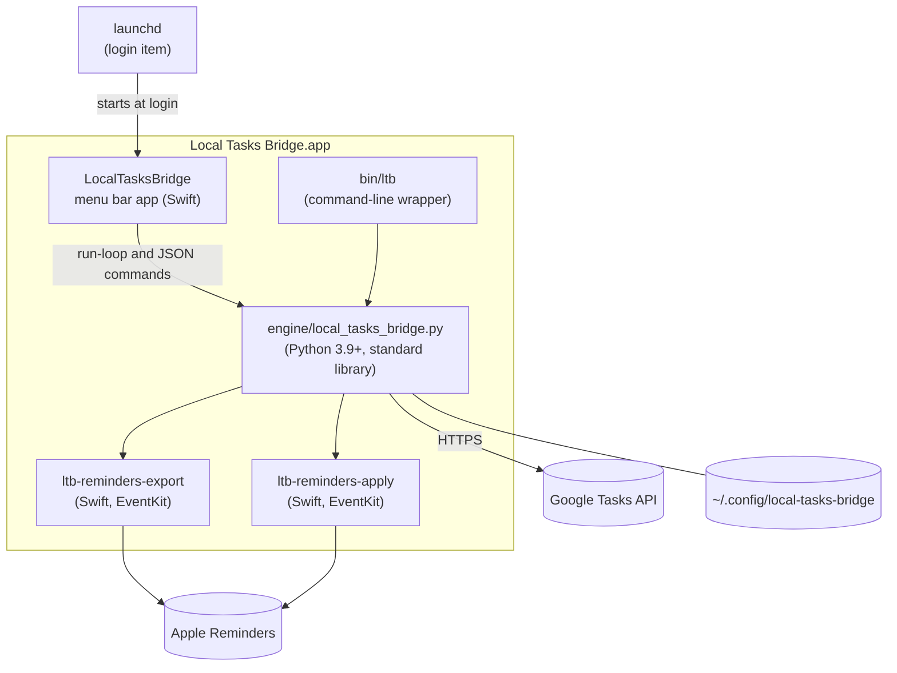

# Architecture

**English** · [简体中文](architecture.zh-CN.md)

This page explains how Local Tasks Bridge is built and how one sync cycle
works. The exact interface between the app and the engine — commands, JSON
shapes, exit codes, files — is specified in
[app-engine-contract.md](app-engine-contract.md).

## Components



| Component | Role |
| --- | --- |
| **Menu bar app** (`macos/App`, Swift) | Owns the macOS Reminders permission; runs and supervises the engine; setup assistant, settings, status, notifications, review of held changes. It never edits sync state itself — it runs engine commands and reads their JSON output. |
| **Engine** (`engine/local_tasks_bridge.py`) | One Python file using only the standard library. Plans and performs synchronization, talks to Google, owns every private file, and provides the `ltb` command line. |
| **Reminders helpers** (`macos/Helpers`) | Two small Swift programs. `ltb-reminders-export` reads lists and reminders as JSON; `ltb-reminders-apply` creates, updates, completes and deletes reminders from JSON operations on standard input. Compiled at build time into `Contents/MacOS`. |
| **`ltb`** (`Contents/Resources/bin/ltb`) | A bash wrapper that picks a suitable Python and runs the engine shipped next to it. |
| **Login item** | LaunchAgent `io.github.siyuanj.local-tasks-bridge`, which starts the app with `--background` at login. |

Anything the app can do can also be done with `ltb`, because both run the same
engine commands.

## Where state lives

| File | Written by | Contents |
| --- | --- | --- |
| `config.json` | engine (`config init/merge`, setup) | Settings ([reference](configuration.md)) |
| `credentials.json` | engine (`client import`) | Your own OAuth client, if any |
| `token.json` | engine (`auth`, token refresh) | OAuth tokens, including the ID token |
| `state.json` | engine (each successful live sync) | The sync map: one record per linked item with Google list and task IDs, the Apple and Google content digests, the source identifier, title, list name and timestamps; plus the account binding hashes |
| `status.json` | engine | Last state, times, failure count, sanitized plan summary (counts, hashes, reasons), the last approval decision, the first line of the last error — no titles |
| `paused`, `sync-now` | engine (`pause`, `sync-now`) | Control files for the background loop |
| `state.lock`, `run-loop.lock` | engine | One sync at a time; one background loop per config folder |
| `backups/` | engine | Copies made before risky operations (reconnect, approvals, sign-out, `config init --force`, migration) |
| `~/Library/Logs/LocalTasksBridge/` | engine, app, launchd | `engine.log` (with titles), `app.log` |

All of these are in folders with mode `0700` and files with mode `0600`.

## One sync cycle, step by step

1. **Load the configuration** and the per-list policies. Invalid settings stop
   the cycle before anything else happens.
2. **Export Reminders.** The export helper returns the active reminders of the
   selected lists — including undated ones when they are synced, and dated
   ones however far ahead they are due — plus the selected lists
   themselves, so that empty lists are mirrored too.
3. **Check the account binding.** The engine hashes the Apple account IDs of
   the selected lists and the Google account ID (the OpenID subject of the
   ID token) and compares them with the binding stored in `state.json`. A
   mismatch stops the cycle with `account_binding_required` before any Google
   list is read.
4. **Read Google.** It lists your task lists, pairs them with the Reminders
   lists by exact name (planning a new Google list where one is missing), and
   reads every paired list including completed, hidden and recently deleted
   tasks.
5. **Index Google tasks.** Tasks are indexed by the *Source UID* in their notes
   footer; fallback indexes by title plus due date, and by title alone, keep
   only unique entries.
6. **Decide what deletions are allowed.** Completions and deletions are
   considered only where the policies allow them and `--no-delete-stale` isn't
   set, and only for lists that already have entries in the sync map — a list
   seen for the first time (first sync, rebuilt or lost map, newly selected
   list) syncs without them on that cycle. If the selected lists exported no
   active reminders at all, deletions
   are skipped for this cycle (the *empty-source guard*); explicitly completed
   reminders can still propagate, so the completed reminders are exported too.
7. **Plan Google → Apple.** For each linked item it compares the Google task
   with the Google digest stored at the last sync. Changed tasks become reminder
   updates or completions; Google tombstones of tracked tasks become reminder
   deletions; Google tasks without a footer are imported (linked to an
   identical reminder, keeping the Google notes after the reminder's own, or
   created as new reminders). When both sides changed,
   the conflict policy decides. A Google edit keeps the reminder's time of day,
   and a due date changed or cleared in Google is applied.
8. **Plan Apple → Google.** Every desired reminder becomes a Google create or
   update unless the task already matches. Tracked items that disappeared from
   Reminders become Google completions (if the reminder was completed) or
   deletions — but only for lists that are still selected and still paired
   with the same Google list; tracked items of any other list are left alone.
   Duplicate Google tasks for the same reminder are cleaned up.
9. **Check the mutation plan.** Both halves form one *mutation plan*. Each
   action is reduced to a target, an operation and a hashed resource
   identifier; the sorted list and the managed population are hashed into the
   plan *fingerprint*, and the deletions and completions alone into the
   *destructive fingerprint*. Titles are never part of a fingerprint. If the
   destructive actions exceed `max_destructive_changes` (25) or
   `max_destructive_ratio` (25 %) of the population, nothing is written unless
   that exact destructive set was approved.
10. **Apply.** Missing Google lists are created; Google → Apple changes go to
    the apply helper in one batch. If anything changed in Reminders, the
    engine exports Reminders (active and completed) and reads Google again, so
    a reminder that was just completed is not mistaken for a deleted one. Then
    Google inserts, updates, completions, deletions and duplicate cleanup are
    written.
11. **Verify.** If the cycle wrote anything to Google, the engine re-reads the
    Google lists and checks that every synced task has the expected title and
    due date, retrying briefly for Google's eventual consistency; a mismatch
    fails the cycle. A cycle that wrote nothing skips this re-read to save
    quota.
12. **Save.** `state.json` is written atomically, then `status.json` — also
    when a conflict (with `skip`) or a failed verification ends the cycle, so
    the map never falls behind what was written.

A dry run (`ltb sync --dry-run`) performs steps 1–9 and prints what would be
done. `approvals show` performs the same planning without any output to
Google or Reminders and returns the destructive items for review.

## Identity and matching

- **Source UID.** Each reminder's identity is a hash of its Apple account ID,
  its list's identifier and its EventKit item identifier (the external
  identifier when there is one). It is stored in the Google task's notes footer
  and as part of the key of its record in `state.json`. Because list and item
  identifiers are specific to the Mac, a second Mac would compute different
  UIDs — one reason to run the bridge on one Mac only.
- **Notes footer.** The engine appends four lines to the Google task's notes:
  `Synced from Apple Reminders.`, `List: …`, `Source UID: …` and
  `Source Digest: …`. Everything from the first line down is stripped when
  notes are copied back to Reminders. Nothing is added to the reminder itself.
- **Digests.** The *Source Digest* hashes the synced content of the reminder
  (title, notes, date, status) together with its modification and completion
  times. The state record also keeps a *Google digest* of the task's synced
  fields as last seen. Comparing current values with these digests tells the
  engine which side changed since the last sync.
- **State records** are keyed by a hash of the Google list ID plus the Source
  UID, and store the Google task ID. If the footer has been removed, the record
  still finds the task by ID and restores the footer.
- **Fallbacks.** A reminder without a matching footer may be linked to a synced
  Google task with the same title and due date, or the same title, but only if
  that match is unique and not claimed by another current reminder.
- **Tombstones.** A deleted Google task deletes its reminder only if the state
  record links exactly that task ID. Old tombstones can't delete a reminder
  you restored, and tombstones are ignored when an active task with the same
  UID exists. A deleted task is created again only if the reminder
  was edited after the deletion or the list doesn't sync deletions; while
  deletions are held (first sync, safe sync, a plan awaiting approval),
  nothing is recreated or written for it.

## Safety mechanisms

| Mechanism | What it prevents |
| --- | --- |
| Mutation plan with fingerprints and limits (25 items / 25 %) | Mass deletion or completion from a bug, a partial export or a mistaken bulk action |
| Held deletions in the background, settled prompt, one question at a time | Stopping all sync because of one large batch; prompts caused by momentary glitches |
| Approval bound to the destructive fingerprint, valid 10 minutes | Applying a different set than the one you reviewed |
| No completions or deletions for lists without sync-map entries (first sync, rebuilt or lost map, new list); `--no-delete-stale` while rebuilding | Deletions decided from an incomplete sync map |
| Empty-source guard | Deleting everything when Reminders or iCloud briefly returns nothing |
| Scope check: only lists still selected and paired with the same Google list can lose items | Deleting Google tasks when a list is unselected, renamed or removed |
| Account binding (Apple account IDs, Google account ID); recovery only through a confirmed, backed-up rebuild (`ltb rebuild`, **Reconnect Google…**) | Reusing one account's sync map for another account |
| Sign-in rejected without the Tasks scope | A half-working sign-in that fails on every cycle |
| Post-write verification of titles and due dates | Silent divergence between the two sides |
| Up to 3 attempts for reads after dropped connections, timeouts, 429 and 5xx; confirmed retry for completions | Duplicated or overwritten writes after an unknown network outcome |
| Sync lock and loop lock | Two engines writing the same state |
| Private files (`0700`/`0600`), titles only in the review window, the dialog, `approvals show` and logs; dialog text passed through the environment, not the command line; `status.json` and notifications keep only an error's first line | Other local users reading task titles or tokens |
| Backups before reconnect, approvals, sign-out and migration | Losing the old state while recovering |

## Scheduler

The app runs `run-loop` as a long-lived child process with
`LTB_EVENT_STREAM=stdout`, so the engine reports events (cycle started and
finished, paused, resumed, notifications, approval requested) as JSON lines
that start with `@@LTB `. The app posts notifications itself.

- **Cadence.** Cycles start every `sync_interval_seconds` (60 by default),
  measured start to start. A cycle that runs long is followed immediately by
  the next. When the Google sign-in uses the shared client, the engine waits at
  least 300 seconds between scheduled cycles and 30 seconds between triggered
  ones, whatever the settings say; it re-evaluates this on every cycle.
- **Sync now.** The app subscribes to EventKit's change notifications. When
  Reminders changes — on this Mac or through iCloud — and when you choose
  **Sync Now**, it touches `sync-now`; the loop notices within about a second
  and starts a cycle, but not sooner than `trigger_min_interval_seconds` (10)
  after the previous start.
- **Pause.** While `paused` exists, cycles are skipped. The file survives
  restarts. `ltb status` then reports `paused` and keeps the last sync result
  visible; sign-in, account and approval problems are still reported first.
- **Writes finish.** Write commands — a sync, approvals, rebuild, migration,
  uninstall, sign-out, client import, config and login-item changes — finish
  before they honour SIGTERM, and the app never cancels them: **Quit** waits
  (“Finishing…”).
- **Held changes.** If a plan exceeds the limits, the cycle runs again with
  deletions and completions held back, so everything else stays in sync, and
  records `awaiting_mutation_approval`. Once the same destructive set has been
  seen on two consecutive cycles, the engine asks. When the app hosts it, the
  engine emits `approval_requested` and the app opens its **Review Pending
  Changes** window, which answers with `approvals apply` (one live sync of
  exactly that set) or `approvals hold`; an unanswered question is repeated
  after 12 hours. Without the app, the engine shows a macOS dialog through
  `osascript`, with **Hold** as default; an **Apply** there is remembered with
  its fingerprint and carried out by the next cycle, which starts early when
  the dialog closes. A different set is asked about at most every 10 minutes;
  after **Hold** the bridge waits 6 hours.
- **Failures.** Errors are recorded in `status.json` with a consecutive-failure
  count and the loop continues with the next cycle; it never exits because of a
  sync error. Only one loop can run per config folder (`run-loop.lock`). On
  SIGTERM an idle loop exits at once; a loop in the middle of a cycle finishes
  it first.

## Process model and macOS privacy

```text
launchd (gui/<uid>, at login)
└─ Local Tasks Bridge.app/Contents/MacOS/LocalTasksBridge --background
   ├─ python3 -B Resources/engine/local_tasks_bridge.py run-loop
   │   ├─ Contents/MacOS/ltb-reminders-export …
   │   └─ Contents/MacOS/ltb-reminders-apply …
   └─ python3 -B … status --json | approvals show --json | …   (short-lived)
```

macOS privacy protection (TCC) attributes a process's access to its
*responsible process* — the app that started it. The menu bar app is the
responsible process for the engine and for both helpers, so the Reminders
permission you give **Local Tasks Bridge** covers them. That is also why the
login item starts the app rather than Python: during the 2026-09 trial a Python
process started directly by launchd could not obtain Reminders access at all.
When you run `ltb` in Terminal, Terminal is the responsible process and needs
its own permission.

The login item runs only in your graphical login session
(`LimitLoadToSessionType: Aqua`), restarts the app if it crashes, and leaves it
stopped after you quit it (`KeepAlive: {SuccessfulExit: false}`). The app runs
the engine with a minimal environment (`PATH=/usr/bin:/bin:/usr/sbin:/sbin`,
`PYTHONDONTWRITEBYTECODE=1`, `PYTHONUNBUFFERED=1`, `LTB_LANG`, and `LTB_CALLER=app` to mark its own calls); the proxy comes
from `config.json`, not from the environment.

Release builds are ad-hoc signed in 1.0. macOS ties privacy permissions to the
code signature, and an ad-hoc signature changes with each build, which is why
an update can bring the Reminders prompt back. A Developer ID signature will
make the permission stable across updates.

## Network access

The engine connects only to:

- `accounts.google.com` and `oauth2.googleapis.com` — sign-in, token refresh
  and revocation (PKCE, loopback redirect to `127.0.0.1` on a random port);
- `openidconnect.googleapis.com` — the account e-mail and ID, for display and
  the account binding;
- `tasks.googleapis.com` — the Google Tasks API.

The app additionally opens GitHub pages when you choose **Help** and asks
GitHub's API for the latest release when you choose **Check for Updates…**.
Nothing is sent to the maintainer.

## Why Python and Swift

- **Proven sync logic.** The engine is the upstream project's synchronization
  core, refined during the 2026-09 trial and covered by about a hundred
  regression tests. Rewriting sync logic is where data-loss bugs come from, so
  1.0 wraps it instead of replacing it.
- **No third-party dependencies.** Python's standard library covers HTTPS,
  OAuth and JSON. Nothing is downloaded at run time and the whole engine can be
  read in one file.
- **EventKit needs native code.** Apple's Reminders framework is available to
  Swift and Objective-C, so two small Swift helpers do the Reminders work. 1.0
  compiles them once at build time instead of interpreting the Swift sources on
  every cycle, which needed the Swift toolchain at run time and took seconds.
- **A native app for the Mac parts.** The menu bar UI, notifications, the login
  item and the Reminders permission belong in a signed app bundle.
- **A narrow, testable boundary.** The app only runs engine commands and reads
  JSON. The engine can be tested without a Mac's real data: `tests/` uses
  synthetic data, and `tests/e2e` drives complete cycles against a fake Google
  Tasks server and fake Reminders helpers through the test-only overrides
  listed in the contract.

## Inherited modes

The engine still contains two modes from the upstream project that 1.0 does
not support: writing reminders to Google Calendar (`target_service:
"calendar"`) and reading the Reminders database directly
(`reminders_source: "sqlite"`). They are kept for compatibility with upstream
installations and may be removed in a future major version.
