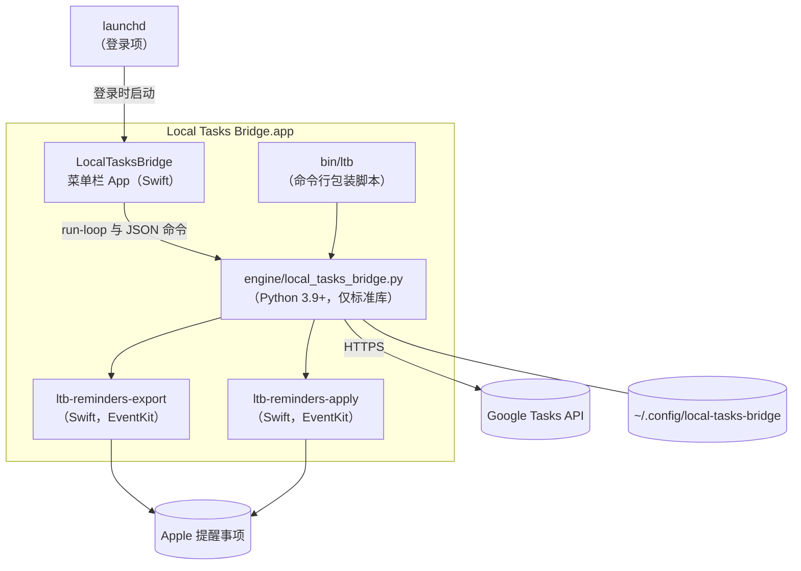

# 架构说明

[English](architecture.md) · **简体中文**

本页说明 Local Tasks Bridge 的构成，以及一轮同步是如何进行的。App 与引擎之间的精确接口——命令、JSON 格式、退出码、文件——规定在 [app-engine-contract.md](app-engine-contract.md)（英文）中。

## 组成部分



| 组成部分 | 作用 |
| --- | --- |
| **菜单栏 App**（`macos/App`，Swift） | 持有 macOS 的提醒事项访问权限；运行并监管引擎；提供设置向导、设置、状态、通知和被暂缓更改的审核。它自己从不修改同步状态——只运行引擎命令并读取其 JSON 输出。 |
| **引擎**（`engine/local_tasks_bridge.py`） | 一个只使用标准库的 Python 文件。负责规划并执行同步、与 Google 通信、管理所有私密文件，并提供 `ltb` 命令行。 |
| **提醒事项辅助程序**（`macos/Helpers`） | 两个小巧的 Swift 程序。`ltb-reminders-export` 以 JSON 输出列表和提醒事项；`ltb-reminders-apply` 从标准输入读取 JSON 操作，创建、更新、完成和删除提醒事项。构建时编译到 `Contents/MacOS` 中。 |
| **`ltb`**（`Contents/Resources/bin/ltb`） | 一个 bash 包装脚本，选择合适的 Python 并运行同一个 App 中自带的引擎。 |
| **登录项** | LaunchAgent `io.github.siyuanj.local-tasks-bridge`，在登录时以 `--background` 参数启动 App。 |

App 能做的任何事情，用 `ltb` 也都能做，因为两者运行的是同样的引擎命令。

## 状态保存在哪里

| 文件 | 写入者 | 内容 |
| --- | --- | --- |
| `config.json` | 引擎（`config init/merge`、设置向导） | 设置（[参考](configuration.zh-CN.md)） |
| `credentials.json` | 引擎（`client import`） | 你自己的 OAuth 客户端（如果有） |
| `token.json` | 引擎（`auth`、刷新令牌） | OAuth 令牌，包括 ID 令牌 |
| `state.json` | 引擎（每次成功的正式同步） | 同步对应关系：每个已关联条目一条记录，包含 Google 列表和任务 ID、Apple 与 Google 两边内容的摘要、源标识、标题、列表名和时间戳；以及账号绑定的哈希值 |
| `status.json` | 引擎 | 上一轮的状态、时间、连续失败次数、脱敏后的计划摘要（数量、哈希值、原因）、最近一次确认决定、上一次错误的第一行——不含标题 |
| `paused`、`sync-now` | 引擎（`pause`、`sync-now`） | 后台循环的控制文件 |
| `state.lock`、`run-loop.lock` | 引擎 | 同一时间只进行一轮同步；每个配置文件夹只运行一个后台循环 |
| `backups/` | 引擎 | 执行有风险的操作（重新连接、确认批量更改、退出登录、`config init --force`、迁移）前的备份 |
| `~/Library/Logs/LocalTasksBridge/` | 引擎、App、launchd | `engine.log`（含标题）、`app.log` |

以上文件夹的权限均为 `0700`，文件为 `0600`。

## 一轮同步的步骤

1. **读取配置**和按列表的策略。设置无效时，本轮在做任何事情之前就会停止。
2. **导出提醒事项。** 导出辅助程序返回所选列表中未完成的提醒事项——包括同步范围内的无日期条目，以及无论多久以后到期的有截止日期的条目——以及所选列表本身，这样空列表也会被镜像。
3. **检查账号绑定。** 引擎对所选列表所属的 Apple 账号 ID 以及 Google 账号 ID（ID 令牌中的 OpenID subject）计算哈希，并与 `state.json` 中保存的绑定比较。不一致时，本轮在读取任何 Google 列表之前就以 `account_binding_required` 停止。
4. **读取 Google。** 列出你的任务列表，按名称与提醒事项列表精确配对（缺少的 Google 列表会被计划创建），并读取每个已配对列表中的全部任务，包括已完成、隐藏和最近删除的任务。
5. **为 Google 任务建立索引。** 任务按其备注末尾同步标记中的 *Source UID* 建立索引；作为后备，还有按“标题 + 截止日期”和仅按标题建立的索引，但只保留唯一的条目。
6. **决定允许哪些删除。** 只有在策略允许、并且没有使用 `--no-delete-stale` 时，才会考虑同步完成和删除。如果所选列表一个未完成的提醒事项也没导出，本轮会跳过删除（*空源保护*）；但明确已完成的提醒事项仍可以同步过去，因此也会导出已完成的提醒事项。
7. **规划 Google → Apple。** 对每个已关联的条目，把 Google 任务与上次同步时保存的 Google 摘要比较。有变化的任务会变成提醒事项的更新或完成；已跟踪任务在 Google 中的删除记录（tombstone）会变成提醒事项的删除；没有同步标记的 Google 任务会被导入（与完全相同的提醒事项关联，或新建提醒事项）。两边都有修改时，由冲突策略决定。Google 中的编辑会保留提醒事项的具体时间；在 Google 中修改或清除的截止日期会同步过来。
8. **规划 Apple → Google。** 每一条应同步的提醒事项，除非对应任务已经一致，否则都会成为 Google 中的创建或更新。从“提醒事项”中消失的已跟踪条目，会成为 Google 中的完成（如果提醒事项是被完成的）或删除——但仅限于仍被选中、并且仍与同一个 Google 列表配对的列表；其他列表中的已跟踪条目一律不动。同一条提醒事项的重复 Google 任务会被清理。
9. **检查更改计划。** 两个方向合在一起构成一份*更改计划*。每个操作被归纳为目标、操作类型和经过哈希的资源标识；排好序的操作列表与受管理条目数一起计算出计划的*指纹*，只包含删除和完成的部分则计算出*删除/完成指纹*。标题永远不参与指纹计算。如果删除与完成的数量超过 `max_destructive_changes`（25），或超过受管理条目的 `max_destructive_ratio`（25%），除非这一组删除/完成已经得到确认，否则不会写入任何内容。
10. **执行。** 先创建缺少的 Google 列表；Google → Apple 的更改一次性交给写入辅助程序。如果“提醒事项”有任何变化，引擎会重新导出提醒事项（未完成和已完成的）并重新读取 Google，以免把刚刚完成的提醒事项误认为已删除。然后写入 Google 的插入、更新、完成、删除和重复清理。
11. **核对。** 如果本轮向 Google 写入了内容，引擎会重新读取 Google 列表，检查每个已同步任务的标题和截止日期是否符合预期；考虑到 Google 的最终一致性，会短暂重试，不一致则本轮失败。没有写入任何内容的一轮会跳过这次重新读取，以节省配额。
12. **保存。** 先原子写入 `state.json`，再写入 `status.json`——即使本轮因冲突（使用 `skip` 时）或核对失败而结束也是如此，因此同步对应关系不会落后于已经写入的内容。

试运行（`ltb sync --dry-run`）执行第 1–9 步，并打印将要做的事。`approvals show` 做同样的规划，不向 Google 或提醒事项写入任何内容，并返回需要审核的删除/完成条目。

## 身份识别与匹配

- **Source UID。** 每条提醒事项的身份，是对其 Apple 账号 ID、所在列表的标识符和 EventKit 条目标识符（有外部标识符时用外部标识符）计算的哈希。它保存在 Google 任务备注末尾的同步标记中，也是该条目在 `state.json` 中记录键的一部分。由于列表和条目的标识符与具体的 Mac 有关，第二台 Mac 会算出不同的 UID——这也是只应在一台 Mac 上运行桥接的原因之一。
- **备注末尾的同步标记。** 引擎会在 Google 任务的备注末尾追加四行：`Synced from Apple Reminders.`、`List: …`、`Source UID: …` 和 `Source Digest: …`。把备注复制回“提醒事项”时，从第一行开始往下的内容都会被去掉。提醒事项本身不会被添加任何内容。
- **摘要。** *Source Digest* 是对提醒事项已同步内容（标题、备注、日期、状态）及其修改时间、完成时间计算的哈希。状态记录中还保存着上次看到的任务同步字段的 *Google 摘要*。把当前值与这些摘要比较，引擎就知道自上次同步以来是哪一边发生了变化。
- **状态记录**以“Google 列表 ID 的哈希 + Source UID”为键，并保存 Google 任务 ID。即使同步标记被删掉了，记录仍能通过 ID 找到任务，并补回同步标记。
- **后备匹配。** 没有匹配同步标记的提醒事项，可能会与一个标题和截止日期相同、或仅标题相同的已同步 Google 任务关联，但前提是这个匹配是唯一的，并且没有被另一条当前的提醒事项占用。
- **删除记录（tombstone）。** 只有当状态记录关联的正是那个任务 ID 时，Google 中被删除的任务才会删除对应的提醒事项。旧的删除记录无法删除你恢复的提醒事项；如果存在一个 UID 相同的未删除任务，删除记录会被忽略。如果在删除之后你又在 Mac 上编辑了这条提醒事项，较新的编辑胜出，任务会在 Google 中重新创建。

## 安全机制

| 机制 | 防止什么 |
| --- | --- |
| 带指纹和上限（25 个 / 25%）的更改计划 | 因程序缺陷、导出不完整或误操作导致的大批量删除或完成 |
| 后台只暂缓删除、计划稳定后才询问、同一时间只问一个问题 | 因为一批大更改而停止全部同步；因短暂异常而弹出询问 |
| 确认与删除/完成指纹绑定，有效期 10 分钟 | 执行的内容与你审核过的不一样 |
| 首次同步和重建时使用 `--no-delete-stale` | 依据不完整的同步对应关系做出删除决定 |
| 空源保护 | “提醒事项”或 iCloud 短暂返回空结果时删除所有内容 |
| 范围检查：只有仍被选中、并且仍与同一个 Google 列表配对的列表才可能被删除条目 | 取消选择、重命名或删除列表时误删 Google 任务 |
| 账号绑定（Apple 账号 ID、Google 账号 ID）；只能通过经过确认、先备份的重建来恢复（`ltb rebuild`、“重新连接 Google…”） | 把一个账号的同步对应关系用到另一个账号上 |
| 缺少 Tasks 权限的登录直接拒绝 | 一个“半可用”的登录导致每一轮都失败 |
| 写入后核对标题和截止日期 | 两边悄无声息地出现不一致 |
| 连接中断、超时、429 和 5xx 后对读取最多重试 3 次；完成操作经确认后重试 | 网络结果未知时重复写入或覆盖写入 |
| 同步锁和循环锁 | 两个引擎同时写入同一份状态 |
| 私密文件（`0700`/`0600`）；标题只出现在审核窗口、对话框、`approvals show` 和日志中；对话框文字通过环境变量而不是命令行参数传递；`status.json` 和通知只保留错误的第一行 | 本机其他用户读取到任务标题或令牌 |
| 重新连接、确认批量更改、退出登录和迁移之前先备份 | 恢复过程中丢失旧状态 |

## 调度器

App 以 `LTB_EVENT_STREAM=stdout` 运行一个长期存在的 `run-loop` 子进程，引擎会以 `@@LTB ` 开头的 JSON 行报告事件（一轮开始与结束、暂停、恢复、通知、请求确认）。通知由 App 自己发出。

- **节奏。** 每隔 `sync_interval_seconds`（默认 60）开始一轮，从上一轮开始计到下一轮开始。耗时过长的一轮结束后，下一轮立即开始。当 Google 登录使用的是共享客户端时，无论设置如何，引擎都会让定时同步之间至少间隔 300 秒、触发的同步之间至少间隔 30 秒；每一轮都会重新判断这一点。
- **立即同步。** App 订阅了 EventKit 的变更通知。当“提醒事项”发生变化（无论是在这台 Mac 上，还是通过 iCloud），或你选择“立即同步”时，App 会触碰 `sync-now` 文件；循环大约一秒内就会发现并开始一轮，但距离上一轮开始不会少于 `trigger_min_interval_seconds`（10 秒）。
- **暂停。** 只要 `paused` 文件存在，就跳过每一轮。重启后这个文件依然存在。
- **被暂缓的更改。** 如果计划超出上限，本轮会在暂缓删除和完成的情况下重新执行，保证其他一切照常同步，并记录为 `awaiting_mutation_approval`。当同一组删除/完成连续两轮出现后，引擎就会询问。由 App 托管时，引擎发出 `approval_requested` 事件，App 打开它的**“查看待确认的更改”**窗口，并用 `approvals apply`（以一次正式同步执行且只执行这一组）或 `approvals hold` 作答；无人回答的问题会在 12 小时后再次提出。没有 App 时，引擎通过 `osascript` 显示一个 macOS 对话框，默认按钮为“暂缓”；在那里选择“执行”后，这个决定会连同指纹一起记下，由下一轮执行——对话框关闭时下一轮会提前开始。不同的一组更改最多每 10 分钟询问一次；选择“暂缓”后，桥接会等待 6 小时。
- **失败。** 错误会连同连续失败次数一起记录在 `status.json` 中，循环继续下一轮；它不会因为同步出错而退出。每个配置文件夹只能运行一个循环（`run-loop.lock`）。收到 SIGTERM 时，空闲的循环立即退出；正在同步的循环会先完成这一轮。

## 进程模型与 macOS 隐私

```text
launchd（gui/<uid>，登录时）
└─ Local Tasks Bridge.app/Contents/MacOS/LocalTasksBridge --background
   ├─ python3 -B Resources/engine/local_tasks_bridge.py run-loop
   │   ├─ Contents/MacOS/ltb-reminders-export …
   │   └─ Contents/MacOS/ltb-reminders-apply …
   └─ python3 -B … status --json | approvals show --json | …   （短暂运行）
```

macOS 的隐私保护（TCC）会把一个进程的访问权限归属到它的*负责进程*——也就是启动它的那个 App。菜单栏 App 是引擎和两个辅助程序的负责进程，所以你授予 **Local Tasks Bridge** 的提醒事项权限也覆盖了它们。这也是登录项启动的是 App 而不是 Python 的原因：在 2026 年 9 月的试用中，由 launchd 直接启动的 Python 进程根本无法获得提醒事项访问权限。在“终端”中运行 `ltb` 时，负责进程是“终端”，它需要单独的权限。

登录项只在你的图形登录会话中运行（`LimitLoadToSessionType: Aqua`）；App 崩溃时会重启它，你主动退出后则保持退出状态（`KeepAlive: {SuccessfulExit: false}`）。App 用一个最小的环境运行引擎（`PATH=/usr/bin:/bin:/usr/sbin:/sbin`、`PYTHONDONTWRITEBYTECODE=1`、`PYTHONUNBUFFERED=1`、`LTB_LANG`，以及标记 App 自身调用的 `LTB_CALLER=app`）；代理设置来自 `config.json`，而不是环境变量。

1.0 的发布版采用临时签名。macOS 把隐私权限与代码签名绑定，而临时签名每次构建都会变化，所以更新后可能再次出现提醒事项权限的请求。改用 Developer ID 签名后，权限会在更新后保持不变。

## 网络访问

引擎只连接以下地址：

- `accounts.google.com` 和 `oauth2.googleapis.com`——登录、刷新令牌和撤销授权（PKCE，回调到本机 `127.0.0.1` 的随机端口）；
- `openidconnect.googleapis.com`——账号邮箱和 ID，用于显示和账号绑定；
- `tasks.googleapis.com`——Google Tasks API。

此外，当你选择“帮助”时，App 会打开 GitHub 页面；当你选择“检查更新…”时，App 会向 GitHub 的 API 查询最新版本。不会向维护者发送任何内容。

## 为什么用 Python 和 Swift

- **久经验证的同步逻辑。** 引擎是上游项目的同步核心，在 2026 年 9 月的试用中又经过打磨，并有约一百个回归测试覆盖。重写同步逻辑正是数据丢失类缺陷的来源，所以 1.0 选择在外面包一层，而不是推倒重来。
- **没有第三方依赖。** Python 标准库就能完成 HTTPS、OAuth 和 JSON。运行时不下载任何东西，整个引擎读一个文件就能看完。
- **EventKit 需要原生代码。** Apple 的提醒事项框架只对 Swift 和 Objective-C 开放，所以由两个小巧的 Swift 辅助程序负责提醒事项相关的工作。1.0 在构建时把它们编译好一次，而不是每一轮都解释执行 Swift 源文件——那样运行时需要 Swift 工具链，而且每次要花好几秒。
- **Mac 相关的部分交给原生 App。** 菜单栏界面、通知、登录项和提醒事项权限，都应当属于一个签名过的 App 包。
- **边界窄、易测试。** App 只运行引擎命令并读取 JSON。引擎可以在不接触真实数据的情况下测试：`tests/` 使用合成数据，`tests/e2e` 通过合同中列出的测试专用覆盖项，用模拟的 Google Tasks 服务器和模拟的提醒事项辅助程序驱动完整的同步轮次。

## 继承自上游的模式

引擎中还保留着上游项目的两种模式，1.0 不支持它们：把提醒事项写入 Google 日历（`target_service: "calendar"`），以及直接读取提醒事项数据库（`reminders_source: "sqlite"`）。保留它们是为了兼容上游的安装，将来的大版本中可能会移除。
